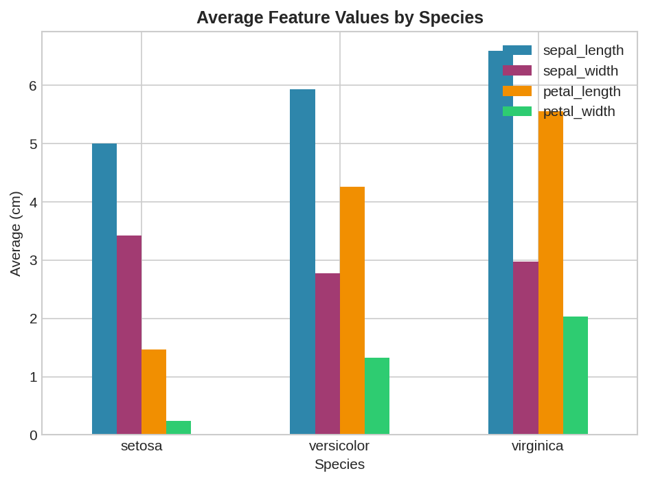
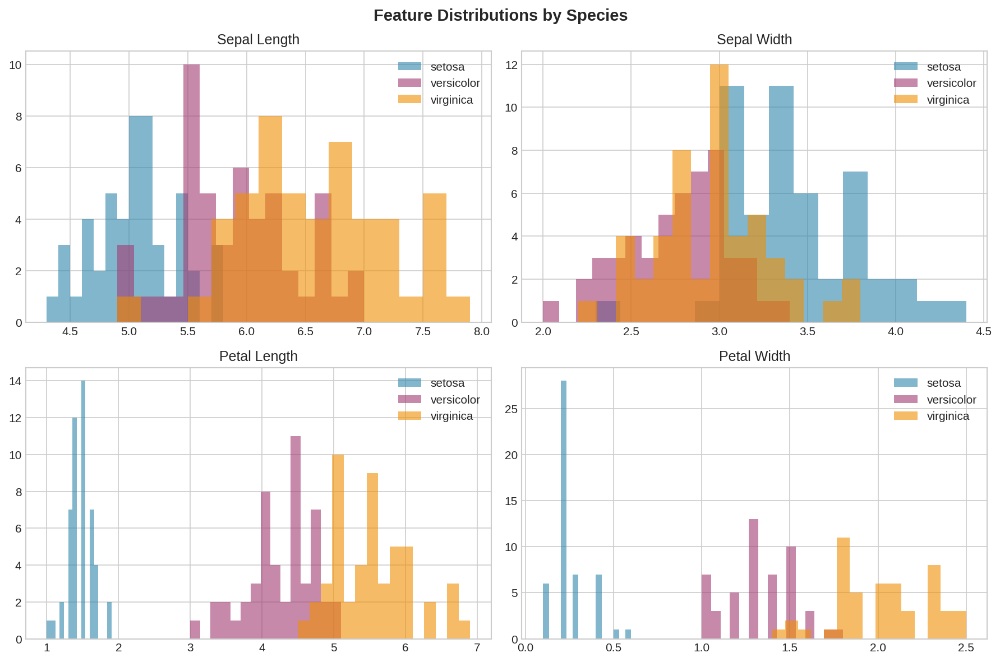
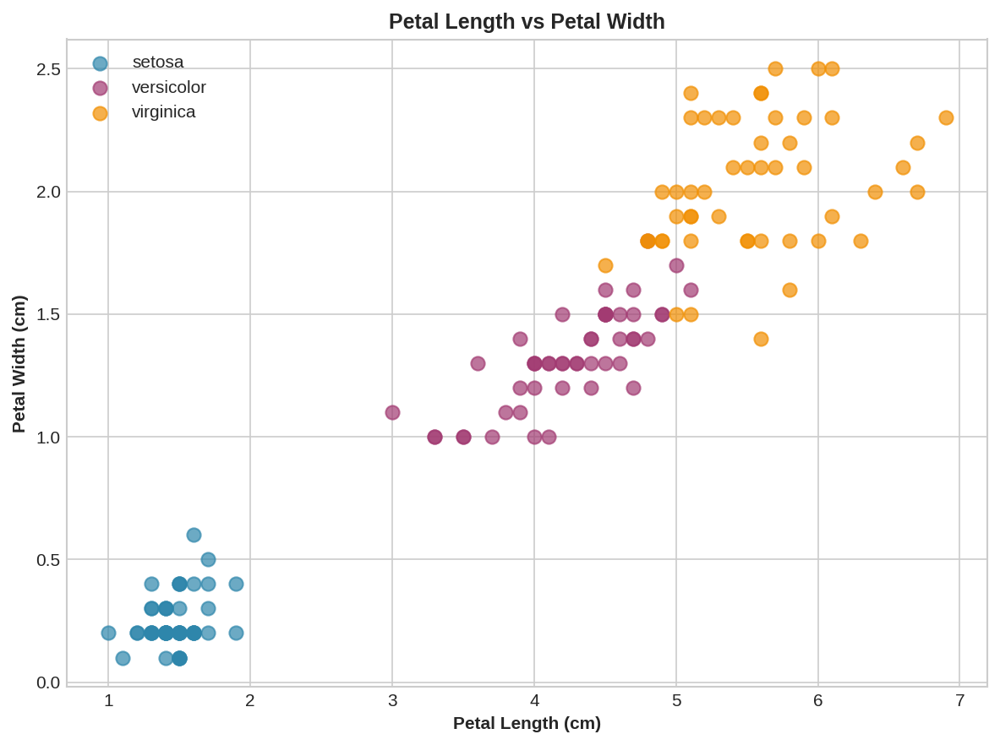
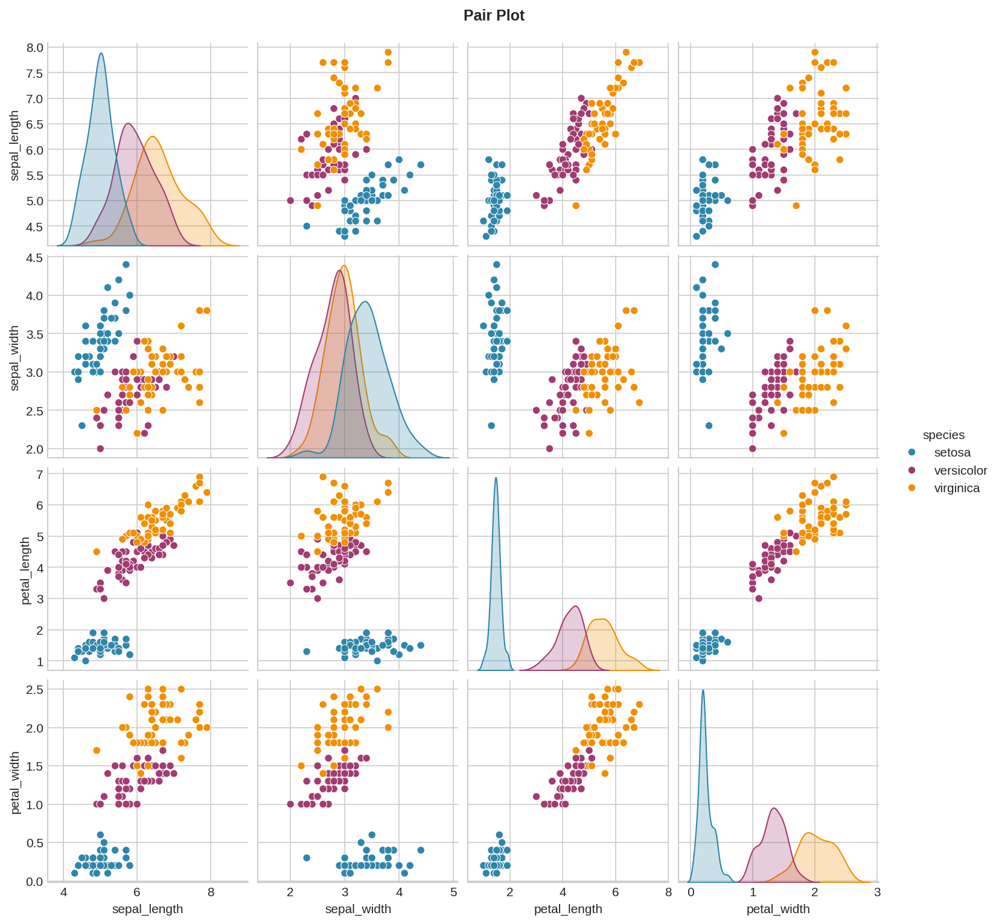
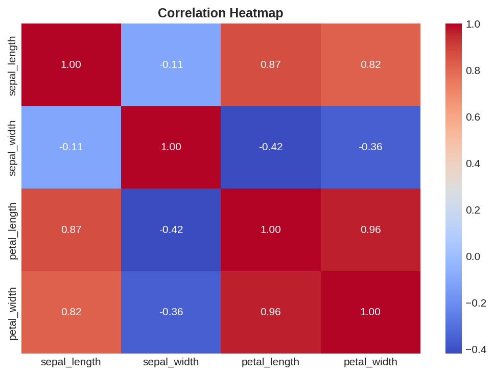

# Task 2 — Data Visualization
**Synent Technologies Data Science Internship**
**Candidate:** Sil Shah | **Level:** Basic

## Problem Statement
Visualize patterns in the Iris dataset to understand
how 4 features differ across 3 flower species.

## Dataset
- **Source:** https://raw.githubusercontent.com/uiuc-cse/data-fa14/gh-pages/data/iris.csv
- **Size:** 150 rows × 5 columns
- **Species:** setosa, versicolor, virginica (50 each)

## Visualizations

| Chart | Purpose |
|-------|---------|
| Bar chart (2×2) | Average feature values per species |
| Histogram (2×2) | Distributions with mean lines |
| Scatter plot | Petal & sepal comparisons |
| Pair plot | All feature combinations |
| Correlation heatmap | Feature relationships |

## Key Insights
- Petal length & width are the best species separators
- Setosa is clearly distinct from versicolor & virginica
- Petal length and petal width are highly correlated (r=0.96)
- Sepal features show more overlap between species

## Visualizations Preview

## Tools Used
Python · Pandas · Matplotlib · Seaborn · Google Colab
